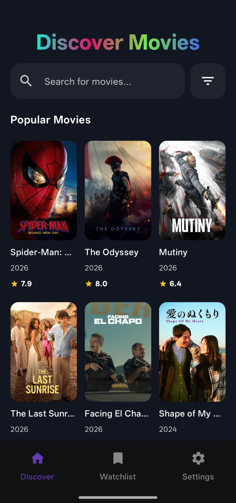
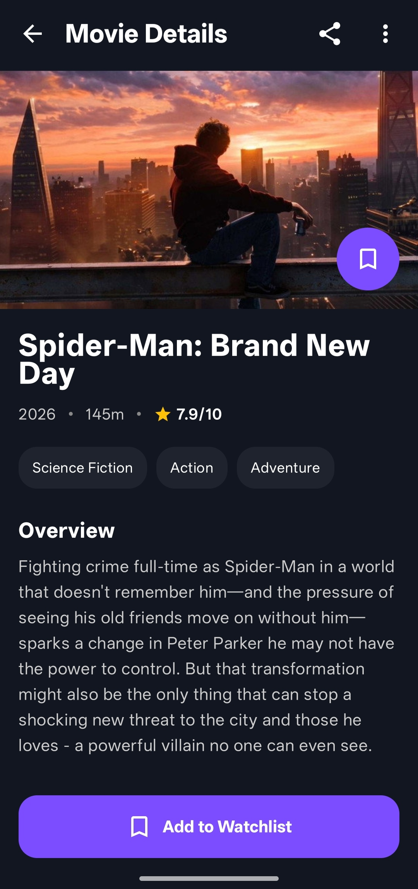
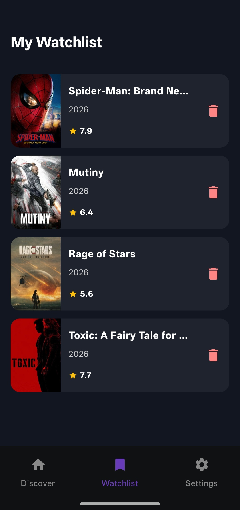

# 🎬 Discover Movies

A modern, feature-rich Android application built with **Jetpack Compose** that allows users to discover popular movies, search titles in real-time, view detailed information, and manage a personal watchlist with offline persistence.

---

## 📱 App Screenshots

| Home / Discover | Movie Details | Watchlist |
| :---: | :---: | :---: |
|  |  |  |

---

## 🚀 Tech Stack & Libraries

* **UI Toolkit:** [Jetpack Compose](https://developer.android.com/jetpack/compose) & Material 3
* **Architecture:** MVVM (Model-View-ViewModel) + Repository Pattern (Clean Architecture principles)
* **Dependency Injection:** [Hilt](https://developer.android.com/training/dependency-injection/hilt-android)
* **Local Database:** [Room Database](https://developer.android.com/training/data-storage/room) (for Watchlist persistence)
* **Networking:** [Retrofit](https://square.github.io/retrofit/) & [OkHttp](https://square.github.io/okhttp/) (TMDB API)
* **JSON Parsing:** [Kotlinx Serialization](https://github.com/Kotlin/kotlinx.serialization)
* **Image Loading:** [Coil 3](https://coil-kt.github.io/coil/)
* **Navigation:** Type-Safe Compose Navigation
* **Asynchronous:** Kotlin Coroutines & Flows

---

## ✨ Key Features

1. **Discover & Popular Movies:** Automatically fetches and displays trending/popular movies upon launching.
2. **Real-time Search:** Search movies dynamically with a clean search bar, clear button (`X`), and keyboard focus management.
3. **Movie Details Screen:** View high-resolution backdrops, runtimes, release dates, genres, ratings, and overviews.
4. **Personal Watchlist:** Save your favorite movies locally using Room Database. Easily add or remove items with real-time UI updates.
5. **Modern Dark Theme:** A carefully crafted rich dark color palette (`#121620`) with gradient typography and sleek card designs.
6. **Secure API Key Handling:** TMDB API key is securely stored in `local.properties` and exposed safely via `BuildConfig`.

---

## 🛠️ Setup & Installation Instructions

To run this project locally on your machine, follow these steps:

1. **Clone the repository:**
  

2. **Open in Android Studio:**
   * Launch Android Studio and select **Open**.
   * Choose the cloned `DiscoverMovies` folder.
   * Wait for Gradle sync to complete.

3. **Configure your TMDB API Key:**
   * Create a free account on [The Movie Database (TMDB)](https://www.themoviedb.org/).
   * Generate your v3 API Key from your profile settings.
   * Open the `local.properties` file in the root of your project and add your API key:
     ```properties
     TMDB_API_KEY=your_actual_tmdb_api_key_here
     ```

4. **Build and Run:**
   * Connect an Android device or start an Emulator.
   * Click the **Run ▶** button in Android Studio.

---

## 📁 Project Structure

```text
com.adityakumar.discovermovies
│
├── data_layer
│   ├── local          # Room Database, Entities, and DAOs
│   ├── remote         # Retrofit API Services & DTOs
│   └── repositoryImpl # Repository Implementations
│
├── domain_layer
│   ├── dataModel      # Domain models & Response DTOs
│   └── repository     # Repository Interfaces
│
├── presentation_layer
│   ├── navigation     # NavHost, Routes (Type-safe)
│   ├── screens        # HomeUi, DetailsUi, WatchlistUi
│   └── viewModel      # MovieViewModel, DetailsViewModel, WatchlistViewModel
│
└── utility            # ResultState wrapper & helpers
```

---

## 📄 License

This project is developed for educational and portfolio purposes. Feel free to use and modify it!
